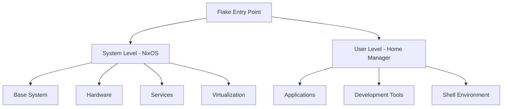

# Architecture Overview

This page provides a high-level overview of the configuration architecture, design decisions, and how all the pieces fit together.

## Design Philosophy

### Modular by Design
The configuration is built around the principle of modularity - each functional area is contained in its own module, making it easy to:
- Enable/disable features
- Understand dependencies
- Maintain individual components
- Extend functionality

### Separation of Concerns


### Declarative Configuration
Everything is defined as code:
- System packages and services
- User applications and dotfiles
- Hardware configuration
- Security settings

## Flake Structure

### Inputs (Dependencies)
The configuration depends on several external flakes:

| Input | Purpose | Stability |
|-------|---------|-----------|
| `nixpkgs` | Main package repository | Stable (25.05) |
| `nixpkgs-unstable` | Latest packages | Rolling |
| `home-manager` | User environment | Stable |
| `disko` | Disk partitioning | Stable |
| `hyprland` | Wayland compositor | Pinned commit |
| `stylix` | System theming | Latest |
| Custom flakes | Specific applications | Various |

### Outputs (What We Generate)
- **nixosConfigurations**: System configurations for each host
- **devShells**: Development environments for different architectures

## Module Hierarchy

### System Modules (`modules/nixos/`)
```
nixos/
├── base/           # Core system functionality
├── hardware/       # Hardware-specific drivers
├── services/       # System services and daemons
├── virtualisation/ # Container and VM support
├── networking/     # Network configuration
├── security/       # Security hardening
└── programs/       # System-wide applications
```

### User Modules (`modules/home-manager/`)
```
home-manager/
├── applications/   # GUI applications
├── development/    # Development environments
├── shells/         # Shell configurations
├── editors/        # Text editors and IDEs
└── utilities/      # CLI tools and utilities
```

## Configuration Flow

### Build Process
1. **Flake Evaluation**: Nix evaluates the flake and its inputs
2. **Module Resolution**: All imported modules are processed
3. **Configuration Merge**: Module options are merged and validated
4. **Package Resolution**: Required packages are determined
5. **Build**: System/user environments are built
6. **Activation**: New configuration is activated

### Update Process
1. **Input Updates**: `nix flake update` updates input versions
2. **Lock File**: `flake.lock` records exact input versions
3. **Rebuild**: System is rebuilt with new inputs
4. **Testing**: Changes are tested before activation
5. **Rollback**: Previous generation available if needed

## Package Management Strategy

### Multiple Package Sources
- **Stable nixpkgs**: For core system packages
- **Unstable nixpkgs**: For latest software versions
- **NUR**: Community packages not in nixpkgs
- **Custom flakes**: Specialized applications
- **Local derivations**: Custom-built packages

### Category-Based Organization
Packages are organized by purpose rather than alphabetically:
- `base.nix`: Essential desktop applications
- `dev.nix`: Development tools and languages
- `cli.nix`: Command-line utilities
- `ai.nix`: AI/ML tools
- `hack.nix`: Security tools
- `money.nix`: Financial applications

## Host Configuration

### Hardware Abstraction
Each host has its own configuration directory:
```
hosts/
└── nixos/
    ├── default.nix           # Host-specific settings
    ├── hardware-configuration.nix  # Auto-generated hardware config
    └── disks.nix            # Disk layout (disko)
```

### Scalability
The `mkHosts` function in `lib/default.nix` makes it easy to:
- Add new hosts
- Share common configuration
- Override host-specific settings
- Support different architectures

## Security Model

### Privilege Separation
- **System-level**: Requires root privileges (nixos-rebuild)
- **User-level**: Regular user privileges (home-manager)
- **Secrets**: Managed separately with SOPS

### Hardening Features
- Firewall configuration
- Service isolation
- User privilege management
- Secure defaults

## Development Workflow

### Local Development
```bash
# Enter development environment
nix develop

# Make changes
$EDITOR modules/nixos/some-module.nix

# Test changes
sudo nixos-rebuild test --flake .#nixos

# Apply changes
sudo nixos-rebuild switch --flake .#nixos
```

### CI/CD Integration
- Automated flake checks
- Build verification
- Documentation updates
- Multi-architecture testing

## Performance Considerations

### Build Optimization
- **Binary Caches**: Avoid rebuilding common packages
- **Parallel Builds**: Utilize multiple CPU cores
- **Incremental Builds**: Only rebuild changed components
- **Store Optimization**: Deduplicate store paths

### Runtime Optimization
- **Service Management**: Only enable needed services
- **Memory Management**: Optimize memory usage
- **Boot Time**: Minimize boot dependencies
- **Package Selection**: Prefer lightweight alternatives

## Extensibility

### Adding New Modules
1. Create module file
2. Add to imports in `default.nix`
3. Document module purpose and options
4. Test with target configuration

### Custom Package Sources
1. Add flake input
2. Reference in module configuration
3. Update flake lock
4. Test package installation

### Host-Specific Customization
1. Override in host configuration
2. Add host-specific modules
3. Conditional configuration based on hostname
4. Hardware-specific optimizations

---

::: tip Next Steps
- Explore the [Module System](/modules) documentation
- Learn about [Package Management](/packages)
- Set up your [Development Environment](/development)
:::